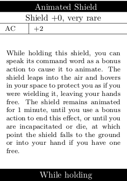
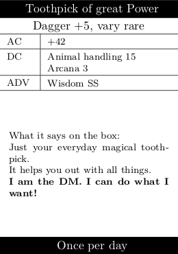

# D&D item card creator

Creates beautiful item cards from easily written `YAML` documents using `Python` and `LaTeX`.

## Usage





All item information can be written into one `YAML` file. You don't know `YAML`? It's quite simple actually:

```yaml
Animated Shield:
  type:                 Shield
  rarity:               very rare
  time:                 While holding
  AC:                   "+2"
  description:          While holding this shield, you can speak its command word as a bonus action to cause it to animate. The shield leaps into the air and hovers in your space to protect you as if you were wielding it, leaving your hands free. The shield remains animated for 1 minute, until you use a bonus action to end this effect, or until you are incapacitated or die, at which point the shield falls to the ground or into your hand if you have one free.
+1 Sword:
  type:                 Sword
  rarity:               common
  attack bonus:         "+1"
  description:          |
                        Just your evereryday sword you might find in a dungeon. Like a sword, but +1. And magical.
                        Has mystic runes etched into the blade.
Toothpick of great Power:
  attack bonus:         "+5"
  rarity:               vary rare
  type:                 Toothpick
  AC:                   "+42"
  DC:                   Animal handling 15/ Arcana 3
  advantages:           Wisdom SS
  time:                 Once per day
  description:          |
                        What it says on the box:
                        Just your everyday magical toothpick.
                        It helps you out with all things.
                        \textbf{I am the DM. I can do what I want!}
```

It is easily executed via the `Python` script in `BASH`.

```bash
./parser.py example/example_items.yaml example/example_items.pdf
```

The two arguments are the input `YAML` file and the location of the output `PDF`.

The `Toothpick of great Power` illustrates all the currently available options. Most of those can be left out. The order is not important. If you want any other options added, just open an issue.

You can always have a look at the sourcecode. It should be pretty robust and I did my best documenting everything and keep it understandable.

As demonstrated in the `Toothpick of great Power` normal `LaTeX` commands should work here, since it is being built as `LaTeX`

## How it works

A `Python` script reads the `YAML` and decodes it, fills in a `jinja2` template of a `LaTeX` file and uses `pdflatex` to build it in a temporary directory, moves out the `PDF` and deletes the temporary directory.

## Requirements

Without further adjustment this probably only works on `UNIX` systems. So no Windows for now `¯\_(ツ)_/¯`.

You will need to have `LaTeX` installed and also `Python 3.6` (or later) with the packages `jinja2` and `pyyaml` installed. Just use PIP for that...

## License

The project is licensed under the [MIT-License](license.md). 
Feel free to expand it any way you please!